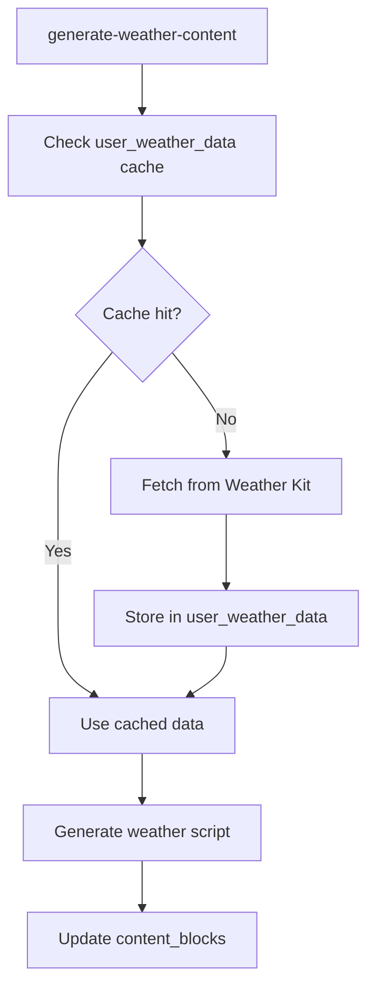

# DayStart Content Schema - Live Implementation

## 🎯 Overview

This document describes the current live database schema for DayStart's content generation system. The implementation uses a unified content blocks approach with weather data caching, deployed to production and ready for iOS app development.

## 📊 Core Table Structure

### **Purpose**
A unified approach to content management that separates content generation from audio synthesis, with full status tracking and timestamps. This approach simplifies the schema while maintaining all functionality.

## 📋 Table Definitions

### **1. Content Blocks Table**

#### **Table Name**: `content_blocks`

#### **Status**: ✅ Deployed to main branch (production)

#### **Purpose**
Stores all content (shared and user-specific) in a unified structure with flexible parameters for different content types.

#### **Columns**

| Column | Type | Description |
|--------|------|-------------|
| `id` | UUID | Primary key, auto-generated |
| `user_id` | UUID | Foreign key to users table (nullable for shared content) |
| `date` | DATE | UTC date this content is for (all content uses UTC dates for consistency) |
| `content_type` | VARCHAR(50) | Type of content (wake_up, stretch, challenge, weather, etc.) |
| `content` | TEXT | Raw content text before script generation |
| `script` | TEXT | The GPT-4o generated text content |
| `audio_url` | VARCHAR(500) | ElevenLabs generated audio file location |
| `status` | VARCHAR(50) | Current state in the generation pipeline |
| `voice` | VARCHAR(100) | ElevenLabs voice identifier used |
| `duration_seconds` | INTEGER | Duration of the generated audio in seconds |
| `retry_count` | INTEGER | Number of retry attempts for failed operations |
| `content_priority` | INTEGER | Priority for content assembly order (lower = higher priority) |
| `expiration_date` | DATE | When this content expires and should be regenerated |
| `language_code` | VARCHAR(10) | Language code for content (default: 'en-US') |
| `parameters` | JSONB | Content-specific parameters (zipcode, sport, philosophy, etc.) |
| `created_at` | TIMESTAMP WITH TIME ZONE | When the record was first created |
| `updated_at` | TIMESTAMP WITH TIME ZONE | Last modification to the record |
| `script_generated_at` | TIMESTAMP WITH TIME ZONE | When GPT-4o finished generating the script |
| `audio_generated_at` | TIMESTAMP WITH TIME ZONE | When ElevenLabs finished creating the audio |

#### **Content Date Strategy**

All content generation functions use **UTC dates** for consistency and to avoid timezone confusion. The app retrieves the most recent content by querying for the latest `created_at` timestamp within each content type.

**Content Types:**
- `wake_up` - General wake-up messages and greetings
- `weather` - Weather information and forecasts
- `encouragement` - Motivational and inspirational content
- `headlines` - News headlines and summaries  
- `sports` - Sports updates and highlights
- `markets` - Financial market updates and analysis
- `user_intro` - Personalized opening messages
- `user_outro` - Personalized closing messages
- `user_reminders` - Personal reminders and tasks

**Date Generation Logic:**
```javascript
// All functions use this UTC date generation
const utcDate = new Date().toISOString().split('T')[0]
```

**App Retrieval Strategy:**
The iOS app queries for the most recent content using:
```sql
SELECT * FROM content_blocks 
WHERE content_type = 'headlines' 
AND status = 'content_ready' 
ORDER BY created_at DESC 
LIMIT 1
```

**Future Content Types (Not in MVP):**
- `stretch` - Morning stretch routines and instructions
- `challenge` - Brain teasers, puzzles, and mental challenges

#### **Parameters Examples**
```json
// Weather content
{
  "zipcode": "12345",
  "location": "New York, NY"
}

// Sports content
{
  "sport": "football",
  "league": "NFL"
}

// Challenge content
{
  "challenge_type": "math",
  "difficulty": "medium"
}

// Encouragement content
{
  "philosophy": "stoic",
  "theme": "resilience"
}

// News content
{
  "country": "US",
  "category": "technology"
}
```

#### **Content Types**

**MVP Content Types:**
- `wake_up` - General wake-up messages and greetings
- `weather` - Weather information and forecasts
- `encouragement` - Motivational and inspirational content
- `headlines` - News headlines and summaries
- `sports` - Sports updates and highlights
- `markets` - Financial market updates and analysis
- `user_intro` - Personalized opening messages
- `user_outro` - Personalized closing messages
- `user_reminders` - Personal reminders and tasks

**Future Content Types (Not in MVP):**
- `stretch` - Morning stretch routines and instructions
- `challenge` - Brain teasers, puzzles, and mental challenges

#### **Status Values**
- `pending` - Record created, waiting to start generation
- `script_generating` - GPT-4o is working on script
- `script_generated` - Script ready, waiting for audio generation
- `audio_generating` - ElevenLabs is working on audio
- `ready` - Complete and available for use
- `content_ready` - Content generation completed successfully
- `content_failed` - Content generation failed
- `script_failed` - GPT-4o generation failed
- `audio_failed` - ElevenLabs generation failed
- `failed` - General failure state
- `expired` - Content is too old to use
- `retry_pending` - Scheduled for retry

#### **Indexes**
- Primary key on `id`
- Index on `(content_type, date)` for shared content lookups
- Index on `(user_id, content_type, date)` for user-specific content
- Index on `status` for background job queries
- Index on `created_at` for cleanup operations
- Index on `expiration_date` for content expiration checks
- Index on `content_priority` for assembly ordering
- Index on `language_code` for language-specific queries
- GIN index on `parameters` for JSONB queries

#### **Constraints**
- `user_id` references `users.id` (when present)
- `content_type` must be one of the defined content types
- `status` must be one of the defined status values
- `date` cannot be in the past (for new records)
- `expiration_date` must be >= date
- `script_generated_at` must be after `created_at`
- `audio_generated_at` must be after `script_generated_at`
- `retry_count` must be >= 0
- `duration_seconds` must be >= 0
- `content_priority` must be >= 0
- `language_code` defaults to 'en-US'

### **2. User Weather Data Table**

#### **Table Name**: `user_weather_data`

#### **Status**: ✅ Deployed to main branch (production)

#### **Purpose**
Stores Weather Kit data as a shared resource, allowing multiple users in the same location to benefit from cached weather data without redundant API calls.

#### **Columns**

| Column | Type | Description |
|--------|------|-------------|
| `id` | UUID | Primary key, auto-generated |
| `location_key` | VARCHAR(100) | Unique location identifier (zipcode or lat/lng) |
| `date` | DATE | Date this weather data is for |
| `weather_data` | JSONB | Complete Weather Kit response data |
| `last_updated` | TIMESTAMP WITH TIME ZONE | When this data was last fetched |
| `expires_at` | TIMESTAMP WITH TIME ZONE | When this data expires and should be refreshed |
| `fetch_count` | INTEGER | Number of times this data has been accessed |
| `created_at` | TIMESTAMP WITH TIME ZONE | When the record was first created |
| `updated_at` | TIMESTAMP WITH TIME ZONE | Last modification to the record |

#### **Location Key Strategy**
The `location_key` field uses a standardized format to identify unique locations:

**For US locations:**
- Format: `zipcode` (e.g., "10001", "90210")

**For international locations:**
- Format: `lat_lng` (e.g., "40.7128_-74.0060" for NYC)

**Examples:**
```sql
-- US locations
location_key = '10001'  -- New York, NY
location_key = '90210'  -- Beverly Hills, CA

-- International locations  
location_key = '51.5074_-0.1278'  -- London, UK
location_key = '35.6762_139.6503'  -- Tokyo, Japan
```

#### **Weather Data JSONB Structure**
The `weather_data` field stores the complete Weather Kit response:

```json
{
  "location": {
    "latitude": 40.7128,
    "longitude": -74.0060,
    "city": "New York",
    "state": "NY",
    "country": "US",
    "zipcode": "10001",
    "timezone": "America/New_York"
  },
  "current": {
    "temperature": 72.5,
    "feels_like": 74.2,
    "humidity": 65,
    "pressure": 1013.25,
    "visibility": 10.0,
    "wind_speed": 8.5,
    "wind_direction": 180,
    "condition": "partly_cloudy",
    "uv_index": 5,
    "timestamp": "2025-01-15T08:00:00Z"
  },
  "forecast": {
    "hourly": [
      {
        "time": "2025-01-15T09:00:00Z",
        "temperature": 75.0,
        "condition": "sunny",
        "precipitation_probability": 0.1
      }
    ],
    "daily": [
      {
        "date": "2025-01-15",
        "high": 78.0,
        "low": 65.0,
        "condition": "partly_cloudy",
        "precipitation_probability": 0.2,
        "sunrise": "07:15",
        "sunset": "16:45"
      }
    ]
  },
  "alerts": [
    {
      "type": "severe_thunderstorm",
      "title": "Severe Thunderstorm Warning",
      "description": "Severe thunderstorms expected in the area",
      "expires": "2025-01-15T12:00:00Z"
    }
  ]
}
```

### **3. User Preferences Table**

#### **Table Name**: `user_preferences`

#### **Status**: ✅ Deployed to main branch (production)

#### **Purpose**
Stores minimal user settings that are critical for backend operations. Content type preferences and specific interests are managed by the app and passed as parameters during content requests.

#### **Columns**

| Column | Type | Description |
|--------|------|-------------|
| `user_id` | UUID | Primary key, references users table |
| `timezone` | VARCHAR(50) | User's timezone for scheduling and timing |
| `location_zip` | VARCHAR(10) | User's zipcode for location-based content matching |
| `voice` | VARCHAR(100) | ElevenLabs voice identifier for user preference |
| `created_at` | TIMESTAMP WITH TIME ZONE | When the record was created |
| `updated_at` | TIMESTAMP WITH TIME ZONE | Last modification to the record |

#### **App-Managed Preferences**
The following preferences are managed by the app and passed as parameters during content requests:

- **Content type toggles** - Which content types to include in morning message
- **Sports teams** - Favorite teams and leagues
- **News categories** - Preferred news topics
- **Philosophical approach** - Stoic, Buddhist, Christian, etc.
- **Challenge preferences** - Math, logic, trivia, etc.

**Note**: Voice preferences are now stored in the `voice` column of the `user_preferences` table.

#### **Example App Request**
```json
// App requests weather content with user's location
GET /content?type=weather&zipcode=12345&user_id=abc123

// App requests sports content with user's teams
GET /content?type=sports&sport=football&teams=["NYG","NYJ"]&user_id=abc123

// App requests encouragement with user's philosophy
GET /content?type=encouragement&philosophy=stoic&user_id=abc123
```

### **4. Logs Table**

#### **Table Name**: `logs`

#### **Status**: ✅ Deployed to main branch (production)

#### **Purpose**
System-wide logging for debugging, monitoring, analytics, and audit trails.

#### **Columns**

| Column | Type | Description |
|--------|------|-------------|
| `id` | UUID | Primary key, auto-generated |
| `event_type` | VARCHAR(100) | Type of event |
| `user_id` | UUID | User who triggered the event (nullable) |
| `content_block_id` | UUID | Related content block ID (nullable) |
| `status` | VARCHAR(50) | Event status ('success', 'error', 'warning', 'info') |
| `message` | TEXT | Detailed event description |
| `metadata` | JSONB | Additional event data |
| `ip_address` | INET | IP address of the request (nullable) |
| `user_agent` | VARCHAR(500) | User agent string (nullable) |
| `created_at` | TIMESTAMP WITH TIME ZONE | When the event occurred |

#### **Event Types**
- `content_generated` - Content generation events
- `alarm_triggered` - Alarm activation events
- `user_login` - User authentication events
- `api_call` - External API calls
- `error_occurred` - System errors and exceptions
- `background_job` - Background job execution
- `content_assembly` - Content combination events
- `cache_hit` - Cache usage events
- `storage_operation` - File storage operations

## 🔄 Workflow Integration

### **Weather Data Fetching Process**
1. **App requests weather content** for a specific location
2. **Check cache** for existing weather data in `user_weather_data`
3. **If cache hit**: Use existing data, increment `fetch_count`
4. **If cache miss**: Fetch from Weather Kit API
5. **Store new data** in `user_weather_data` table
6. **Generate weather content** using the weather data

### **Content Generation Pipeline**
1. **Record Creation**: Background job creates `pending` record for content
2. **Content Generation**: Content generation functions create content blocks with `content_ready` or `content_failed` status
3. **Script Generation**: GPT-4o generates content, updates `script_generated_at`
4. **Audio Synthesis**: ElevenLabs converts script to audio, updates `audio_generated_at` and `duration_seconds`
5. **Completion**: Status set to `ready` for app consumption
6. **Logging**: Each step logged with appropriate event_type and status

### **Content Generation Functions**

The system includes 6 content generation functions that run autonomously to create content blocks:

#### **Function Priority Order (by content_priority)**
1. **`generate-wake-up-content`** - Priority: **1** (Highest Priority)
   - Wake-up messages and holiday information
   - Status: `content_ready` on success, no content block on failure

2. **`generate-weather-content`** - Priority: **2**
   - Weather information for user locations
   - Status: `content_ready` on success, no content block on failure

3. **`generate-headlines-content`** - Priority: **3**
   - News headlines from multiple sources (News API, GNews)
   - Status: `content_ready` on success, `content_failed` on API failures

4. **`generate-sports-content`** - Priority: **4**
   - Sports events and scores (SportsDB, ESPN APIs)
   - Status: `content_ready` on success, `content_failed` on API failures

5. **`generate-markets-content`** - Priority: **5**
   - Market data and business news (Yahoo Finance, News API)
   - Status: `content_ready` on success, `content_failed` on API failures

6. **`generate-encouragement-content`** - Priority: **6** (Lowest Priority)
   - Encouragement messages (Christian, Stoic, Muslim, Jewish, General)
   - Status: `content_ready` on success, no content block on failure

#### **Status Flow**
- **Success**: Functions set status to `content_ready` after successful content generation
- **Failure**: Functions either set status to `content_failed` or don't create content blocks
- **Previous Content**: Functions exclude `content_failed` status when looking for previous content to avoid repetition

### **Integration with Content Generation**


## 📊 Benefits

### **Performance**
- **Reduced API calls** - Multiple users share cached weather data
- **Faster response times** - No waiting for Weather Kit API
- **Lower costs** - Fewer API requests to Apple
- **Unified content structure** - Simplified queries and management

### **Reliability**
- **Fallback data** - Cached data available during API outages
- **Consistent experience** - All users get same weather data for location
- **Reduced rate limiting** - Fewer API calls per location
- **Comprehensive logging** - Full audit trail for debugging

### **Scalability**
- **Location-based sharing** - Efficient for popular locations
- **Automatic cleanup** - Prevents table bloat
- **Configurable expiration** - Balance freshness vs performance
- **Flexible content types** - Easy to add new content types

## 🔐 RLS Policies

### **Content Blocks Access Control**
- Users can read shared content (user_id IS NULL)
- Users can read/write their own user-specific content (user_id = auth.uid())
- Service role can read/write all content for background jobs

### **Weather Data Access Control**
- **Read access** for all authenticated users (shared resource)
- **Write access** only for service role (background jobs)
- **No user-specific data** - location-based sharing

### **User Preferences Access Control**
- Users can only read/write their own preferences (user_id = auth.uid())
- Service role can read/write all preferences for background jobs

### **Logs Access Control**
- Users can read their own logs (user_id = auth.uid())
- Service role can read/write all logs for system monitoring
- Users cannot write logs (insert/update/delete) - only system can

## 📈 Indexes and Performance

### **Primary Indexes**
- Primary key on `id` for all tables
- Index on `(content_type, date)` for shared content lookups
- Index on `(user_id, content_type, date)` for user-specific content
- Index on `(location_key, date)` for weather data lookups
- Index on `expires_at` for cleanup operations
- Index on `status` for background job queries

### **Query Optimization**
```sql
-- Find weather data for location and date
SELECT weather_data FROM user_weather_data 
WHERE location_key = '10001' AND date = '2025-01-15';

-- Find ready content for user and date
SELECT * FROM content_blocks 
WHERE user_id = 'abc123' AND date = '2025-01-15' AND status = 'ready';

-- Find shared content for date
SELECT * FROM content_blocks 
WHERE user_id IS NULL AND date = '2025-01-15' AND status = 'ready';
```

## 🚨 Considerations

### **Data Freshness**
- **Weather changes rapidly** - 1-hour cache expiration
- **Critical weather** - Alerts and severe weather bypass cache
- **User preferences** - Some users may want real-time data
- **Content expiration** - Configurable per content type

### **Storage Strategy**
- `script` content can be large (several KB per script)
- `audio_url` points to external storage (Supabase Storage or CDN)
- `weather_data` JSONB can be substantial for detailed forecasts
- Consider archiving old records to manage table size

## ✅ Current Status

All tables are **live in production** and ready for iOS app development:

- ✅ **content_blocks** - Unified content storage deployed
- ✅ **user_weather_data** - Weather caching system deployed  
- ✅ **user_preferences** - User settings deployed
- ✅ **logs** - System monitoring deployed
- ✅ **users** - Authentication system deployed

The backend infrastructure is complete and ready to support the DayStart iOS application! 