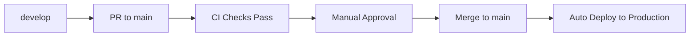

# DayStart Deployment Guide

## 🎯 Overview

DayStart uses a dual-environment deployment system with automated CI/CD pipelines:

- **`main` branch** → Production environment (`project_ref`)
- **`develop` branch** → Development environment (`project_ref`)

✅ **Status: Deployment system is fully operational and tested. All content generation functions and database schema are deployed to main branch (production).**

## 🚀 Quick Start (5 Minutes)

### 1. **Reliable Deployment Methods**

#### Option A: Use the Deployment Script (Recommended)
```bash
# Run the automated deployment script
./deploy.sh
```

This script will:
- ✅ Check you're on the develop branch
- ✅ Verify no uncommitted changes
- ✅ Ensure you're up to date with remote
- ✅ Push to develop branch
- ✅ Trigger manual deployment
- ✅ Provide monitoring links

#### Option B: Manual GitHub Actions Trigger
If automatic deployment isn't working, you can manually trigger deployments:

```bash
# Trigger manual deployment to develop
gh workflow run "Deploy to Development" --ref develop

# Check deployment status
gh run list --workflow="deploy-develop.yml" --limit 5
```

**Manual Deployment Process:**
1. **Push your changes** to the develop branch
2. **Trigger manual workflow** using GitHub CLI or web interface
3. **Monitor the deployment** in GitHub Actions tab
4. **Verify the deployment** by checking Supabase function code

**When to Use Manual Deployment:**
- ✅ Automatic deployment isn't triggering
- ✅ You need to force a deployment with latest code
- ✅ Debugging deployment issues
- ✅ Ensuring clean deployment state

### 2. **Enable GitHub Integration in Supabase**
1. Go to [Supabase Dashboard](https://supabase.com/dashboard)
2. Select your project
3. Navigate to **Settings** → **GitHub**
4. Click **"Connect GitHub"**
5. Authorize Supabase to access your GitHub repository
6. Select your repository
7. Configure deployment settings:
   - **Supabase directory path**: `supabase`
   - **Production branch**: `main`
   - **Enable automatic branching**: ✅ Checked

### 2. **Configure GitHub Secrets**
Set these secrets in your GitHub repository settings:

#### Production Environment (`main` branch)
```bash
SUPABASE_URL=your_supabase_url
SUPABASE_SERVICE_ROLE_KEY=your_production_service_role_key
SUPABASE_MAIN_PROJECT=project_ref
SUPABASE_ACCESS_TOKEN=your_supabase_access_token
SUPABASE_DB_PASSWORD=your_database_password
```

#### Development Environment (`develop` branch)
```bash
SUPABASE_URL=your_supabase_url
SUPABASE_SERVICE_ROLE_KEY=your_development_service_role_key
SUPABASE_DEVELOP_PROJECT=project_ref
SUPABASE_ACCESS_TOKEN=your_supabase_access_token
SUPABASE_DB_PASSWORD=your_database_password
```

### 3. **Set Up Branch Protection (Recommended)**
In GitHub repository settings:
1. Go to **Settings** → **Branches**
2. Add rule for `main` branch:
   - ✅ Require status checks to pass
   - ✅ Require branches to be up to date
   - ✅ Require pull request reviews
   - ✅ Restrict direct pushes

## 🔄 Deployment Workflow

### Development Workflow


**Steps:**
1. Create feature branch from `develop`
2. Make changes and push to feature branch
3. Create PR to `develop` branch
4. CI pipeline runs automatically
5. After approval and merge, automatic deployment to develop environment

## 🚀 Daily Development Workflow

### **Recommended Deployment Process**
For reliable deployments, use the deployment script:

```bash
# 1. Make your changes
# 2. Commit your changes
git add .
git commit -m "Your changes"

# 3. Run the deployment script
./deploy.sh
```

The deployment script will:
- ✅ Verify you're on the develop branch
- ✅ Check for uncommitted changes
- ✅ Ensure you're up to date with remote
- ✅ Push to develop branch
- ✅ Trigger manual deployment
- ✅ Provide monitoring links

### **Alternative: Manual GitHub Actions**
If you prefer manual control:

```bash
# 1. Push your changes
git push origin develop

# 2. Trigger deployment manually
gh workflow run "Deploy to Development" --ref develop

# 3. Monitor progress
# Check: https://github.com/n8peace/DayStart/actions
```

### **Iterative Development Process**
The beauty of this setup is that you can iterate rapidly on `develop`:

```bash
# Morning: Start working
git checkout develop
git pull origin develop

# Make changes and test locally
# ... your development work ...

# Deploy to development environment
git push origin develop  # → Automatic deployment to Supabase dev

# Test in development environment
# ... test your changes ...

# Afternoon: More iterations
# Make more changes...
git push origin develop  # → Automatic deployment to Supabase dev

# Test again...
git push origin develop  # → Automatic deployment to Supabase dev

# Evening: Ready for production
# Create PR: develop → main
# Review & merge → Automatic deployment to production
```

### **Key Benefits:**
- ✅ **Every push to `develop`** automatically deploys to development environment
- ✅ **No manual deployment steps** during development
- ✅ **All changes accumulate** in the `develop` branch
- ✅ **When ready**, promote entire tested state to production
- ✅ **No cherry-picking needed** - you get everything that was working

### **What Happens on Each Push to `develop`:**
1. **Automatic deployment** to Supabase development environment
2. **Database migrations** applied
3. **Edge functions** deployed (if any)
4. **Health checks** run
5. **Success/failure notifications** sent

### Production Workflow
**When you're satisfied with all changes in `develop`:**



**Steps:**
1. Create PR from `develop` to `main`
2. CI pipeline runs automatically
3. Manual review and approval required
4. Merge to `main` branch
5. **Automatic production deployment** (includes ALL changes from develop)

## 📋 Required Repository Structure

### **Minimum Structure**
```
your-project/
├── .github/
│   └── workflows/          # GitHub Actions
├── supabase/
│   ├── config.toml         # Supabase config
│   └── migrations/         # Database migrations
│       └── 20240101000000_create_users_table.sql
└── README.md
```

## 🚀 Workflow Files

### Production Deployment (`.github/workflows/deploy-main.yml`)
- **Automatic**: Triggers on push to `main` branch
- **Manual**: Workflow dispatch with confirmation dialog
- **Validation**: Branch validation, environment variable checks
- **Health Checks**: Post-deployment verification of database

### Development Deployment (`.github/workflows/deploy-develop.yml`)
- **Automatic**: Triggers on push to `develop` branch
- **Manual**: Workflow dispatch (no confirmation required)
- **Validation**: Environment variable checks
- **Health Checks**: Post-deployment verification of database

## 📊 Deployment Process

### 1. Environment Validation
- Validates all required secrets are present
- Checks branch permissions and working directory state
- Ensures proper environment configuration

### 2. Supabase Deployment
- Links to appropriate Supabase project
- Deploys database migrations
- Sets environment variables

### 3. Health Checks
- Verifies database connectivity via API
- Validates deployment status
- Checks migration file integrity

### 4. Notification
- Success notifications with deployment details
- Failure notifications with rollback guidance

## 🗄️ Database Migrations

### Migration Process
1. Create migration file in `supabase/migrations/`
2. Test locally with `supabase db reset`
3. Push to develop branch
4. Automatic deployment to develop environment
5. Test in develop environment
6. Deploy to production when ready

### Migration Naming
Use timestamp format: `YYYYMMDDHHMMSS_description.sql`

Example: `20240101120000_create_users_table.sql`

## 📅 Recent Deployments

### 2025-01-15: Content Generation System Deployment to Production
**Status**: ✅ **DEPLOYED TO MAIN BRANCH (PRODUCTION)**

**Complete System Deployed:**
- ✅ All 6 content generation functions deployed to production
- ✅ All database migrations applied to production
- ✅ Content generation system fully operational
- ✅ API integrations tested and working
- ✅ Error handling and status management implemented

**Functions Deployed to Production:**
1. `generate-wake-up-content` - Priority 1
2. `generate-weather-content` - Priority 2  
3. `generate-headlines-content` - Priority 3
4. `generate-sports-content` - Priority 4
5. `generate-markets-content` - Priority 5
6. `generate-encouragement-content` - Priority 6

**Database Schema Updates Applied:**
- ✅ `20250101000005_add_voice_to_user_preferences.sql`
- ✅ `20250101000006_add_content_column_to_content_blocks.sql`
- ✅ `20250101000007_remove_legacy_functions.sql`
- ✅ `20250101000008_add_content_ready_status.sql`

**System Status:**
- **Production Environment**: Fully operational
- **Content Generation**: Autonomous and working
- **API Integrations**: All external APIs connected
- **Error Handling**: Comprehensive error management
- **iOS App Ready**: System ready for iOS app development

## 🔍 Troubleshooting

### Common Issues

#### Automatic Deployment Not Triggering
**Issue**: Pushes to develop branch don't automatically trigger deployment
**Symptoms**: 
- GitHub Actions workflow doesn't run on push
- Supabase functions show old code
- No deployment notifications

**Solutions**:
1. **Check Workflow File**: Ensure `.github/workflows/deploy-develop.yml` exists and is properly configured
2. **Verify Branch Name**: Ensure you're pushing to `develop` branch (not `main` or other branches)
3. **Check Workflow Permissions**: Ensure workflow has proper permissions to run
4. **Use Manual Deployment**: Trigger deployment manually as a workaround:
   ```bash
   gh workflow run "Deploy to Development" --ref develop
   ```

**Manual Deployment Verification**:
- ✅ **GitHub Actions**: Check Actions tab for successful workflow runs
- ✅ **Supabase Function Code**: Verify function shows latest changes
- ✅ **Function Logs**: Check Supabase dashboard for execution logs
- ✅ **Health Checks**: Verify functions respond correctly

#### Source Code vs Compiled Code in Supabase Dashboard
**Issue**: Code shown in Supabase Dashboard looks different from your repository
**Explanation**: This is **expected behavior** - Supabase shows the compiled/transpiled JavaScript, not your TypeScript source code

**What You See in Supabase Dashboard:**
- ✅ **Compiled JavaScript** - TypeScript converted to JavaScript
- ✅ **Minified/Processed** - Code optimized for production
- ✅ **Runtime Version** - What's actually executing

**What's in Your Repository:**
- ✅ **TypeScript Source** - Original `.ts` files you write
- ✅ **Human-readable** - With proper formatting, comments, and types
- ✅ **Development Version** - What you edit and commit

**Verification**: Your functions ARE running the latest code from your repository, even though the dashboard shows the compiled version.

**How to Verify Deployments Are Working:**
1. Check GitHub Actions: `https://github.com/n8peace/DayStart/actions`
2. Look for `Deploy to Development` workflow runs with `✅ success`
3. Test your functions - they'll execute your latest code
4. Monitor function logs in Supabase Dashboard for execution details

#### Missing Environment Variables
```
❌ Missing required environment variable: SUPABASE_URL
```
**Solution**: Add the missing secret to GitHub repository settings

#### Database Connectivity Issues
```
⚠️ Database connectivity check failed (HTTP 401)
```
**Solution**: 
1. Verify service role key is correct
2. Check if users table exists
3. Verify RLS policies are configured correctly

#### Project Linking Failures
```
Error: Project not found
```
**Solution**:
1. Verify project reference is correct
2. Check Supabase access token has proper permissions
3. Ensure project exists and is accessible

#### Function Health Check Failures

##### HTTP 500 Errors (Function Runtime Errors)

##### Database Constraint Violations
**Issue**: `content_blocks_audio_timing_check` constraint violation
**Error**: `new row for relation "content_blocks" violates check constraint "content_blocks_audio_timing_check"`

**Root Cause**: Race condition between script generation and audio generation processes, or timezone inconsistencies in timestamp handling.

**Solution**: 
1. **Optimistic Locking**: Functions now use optimistic locking to prevent concurrent updates
2. **UTC Timestamp Consistency**: All timestamps use consistent UTC handling with `ensureTimestampAfter()` helper
3. **Safety Buffer**: Audio generation adds 2-second buffer to ensure `audio_generated_at > script_generated_at`
4. **Error Handling**: Detailed logging for constraint violations to aid debugging

**Prevention**:
- Functions fetch current timestamps before updates to prevent race conditions
- Use `utcDate()` utility for consistent date handling
- Implement proper error handling for constraint violations

##### HTTP 500 Errors (Function Runtime Errors)
```
❌ generate-headlines-content function health check failed (HTTP 500)
```
**Common Causes:**
1. **Invalid Database Status Values**: Functions using status values not in database constraints
   - **Solution**: Ensure functions use valid status values from schema
   - **Valid Statuses**: `'pending'`, `'script_generating'`, `'script_generated'`, `'audio_generating'`, `'ready'`, `'script_failed'`, `'audio_failed'`, `'failed'`, `'expired'`, `'retry_pending'`
   - **Invalid Statuses**: `'content_ready'`, `'content_failed'` (not in schema)

2. **Missing Environment Variables**: Required API keys or Supabase credentials not set
   - **Solution**: Add missing environment variables to Supabase function settings
   - **Common Missing Variables**: `NEWS_API_KEY`, `GNEWS_API_KEY`, `WEATHER_API_KEY`, etc.

3. **External API Timeouts**: Functions hanging on external API calls
   - **Solution**: Functions now include 10-second timeouts for external API calls

##### HTTP 400 Errors (Expected Business Logic)
```
❌ generate-weather-content function health check failed (HTTP 400)
```
**Expected Behavior**: Some functions return 400 when no data is available to process
- **Weather Function**: Returns 400 when no weather data exists in `user_weather_data` table
- **Solution**: Health checks are configured to accept 400 responses from weather function as healthy

#### Legacy Function Cleanup
**Issue**: Old functions remain in Supabase after updates
**Solution**: Deployment workflows now automatically remove legacy functions before deploying new ones
- **Legacy Functions Removed**: `generate-message`, `test-voice`
- **Process**: Functions are deleted during deployment, then new functions are deployed

### Debug Commands
```bash
# Check Supabase CLI status
supabase status

# Check migration status
supabase migration list

# Validate project setup
supabase projects list

# Check deployment script
./deploy.sh --help  # (if you add help functionality)
```

## 🛠️ Deployment Script Reference

### **deploy.sh**
The deployment script automates the deployment process and includes safety checks.

**Location**: `./deploy.sh` (in project root)

**Usage**:
```bash
./deploy.sh
```

**What it does**:
1. **Pre-deployment Checks**:
   - Verifies you're on the `develop` branch
   - Checks for uncommitted changes
   - Ensures you're up to date with remote

2. **Deployment Process**:
   - Pushes to develop branch
   - Triggers manual GitHub Actions workflow
   - Provides monitoring links

3. **Safety Features**:
   - Exits on any error (`set -e`)
   - Clear error messages
   - Prevents deployment with uncommitted changes

**Example Output**:
```
🚀 DayStart Deployment Script
==============================
✅ Pre-deployment checks passed
📤 Pushing to develop branch...
✅ Code pushed to develop branch
🚀 Triggering manual deployment...
✅ Deployment triggered successfully!

📊 Monitor deployment progress:
   https://github.com/n8peace/DayStart/actions

🔍 Check Supabase function logs:
   https://supabase.com/dashboard/project/[YOUR_PROJECT_ID]/functions

🎉 Deployment initiated! Check the GitHub Actions tab for progress.
```

**Troubleshooting the Script**:
- **"You must be on the develop branch"**: Run `git checkout develop`
- **"You have uncommitted changes"**: Commit your changes first
- **"Not up to date with remote"**: Run `git pull origin develop`

## 📈 Monitoring

### GitHub Actions
- Monitor deployment status in Actions tab
- Check logs for detailed error information
- Review health check results

### Supabase Dashboard
- Check database status in Database section

## 🎓 Lessons Learned & Best Practices

### Function Development
1. **Database Schema Compliance**: Always verify function code matches database constraints
   - Check status values against schema constraints
   - Ensure column names and types match exactly
   - Test database operations locally before deployment

2. **Environment Variable Management**: 
   - Set all required environment variables in Supabase function settings
   - Use descriptive error messages when variables are missing
   - Implement graceful fallbacks for optional variables

3. **External API Integration**:
   - Always implement timeouts for external API calls (10 seconds recommended)
   - Handle API failures gracefully without breaking the entire function
   - Log API call results for debugging

4. **Error Handling Patterns**:
   - Use try-catch blocks around all external operations
   - Log errors with sufficient detail for debugging
   - Return appropriate HTTP status codes (400 for business logic failures, 500 for system errors)

### Health Check Strategy
1. **Function-Specific Logic**: Different functions may have different "healthy" states
   - Weather function: 400 is healthy when no data available
   - Content functions: 200 is healthy when content generated
   - API functions: 200 is healthy when APIs respond

2. **Graceful Degradation**: Functions should handle missing data gracefully
   - Return appropriate status codes for different failure modes
   - Provide clear error messages for debugging
   - Continue operation when possible even with partial failures

### Deployment Workflow
1. **Legacy Cleanup**: Always remove old functions before deploying new ones
   - Prevents confusion about which functions are active
   - Ensures clean deployment state
   - Reduces potential conflicts

2. **Incremental Testing**: Test functions individually before full deployment
   - Use health checks to verify each function
   - Monitor logs for specific function issues
   - Fix issues before proceeding to production

3. **Environment Parity**: Keep development and production workflows synchronized
   - Apply the same fixes to both environments
   - Use consistent health check logic
   - Maintain similar error handling patterns
- Review deployment history in Settings → GitHub

## 🔒 Security Considerations

1. **Never commit secrets** to the repository
2. **Use environment-specific secrets** (PROD/DEV suffixes)
3. **Rotate access tokens** regularly
4. **Review deployment logs** for sensitive information
5. **Enable branch protection** on main branch
6. **Database URLs contain sensitive credentials** - keep them secure

## 🔄 Rollback Procedures

### Database Rollback
1. Create new migration to revert changes
2. Deploy to develop first
3. Test thoroughly
4. Deploy to production

### Emergency Rollback
1. Use Supabase Dashboard to restore from backup
2. Deploy known good migration
3. Verify system stability

## 📚 Best Practices

### 1. Branch Strategy
- Use `main` for production
- Use `develop` for staging
- Use `feature/*` for development
- Never push directly to `main`

### 2. Migration Management
- Always test migrations locally first
- Use descriptive migration names
- Keep migrations small and focused
- Never modify existing migrations

### 3. Security
- Never commit API keys to repository
- Use environment variables for secrets
- Enable branch protection rules
- Review deployment logs regularly

### 4. General
- **Always test in develop first**
- **Use descriptive commit messages**
- **Review PRs thoroughly before merging**
- **Monitor deployments for errors**
- **Keep migration files small and focused**
- **Document breaking changes**
- **Use feature flags for major changes**

## 🔗 Useful Links

- [Supabase GitHub Integration Docs](https://supabase.com/docs/guides/platform/github-integration)
- [Supabase CLI Docs](https://supabase.com/docs/guides/cli)
- [Database Migrations Docs](https://supabase.com/docs/guides/cli/migrations)

---

*This deployment system provides automated, reliable deployments with comprehensive validation and health checks for both development and production environments. For initial setup, see [supabase-setup.md](supabase-setup.md).*
