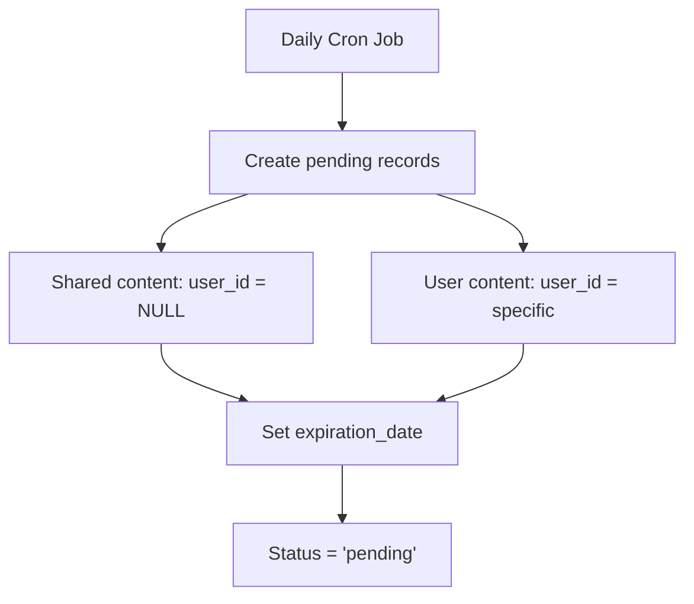
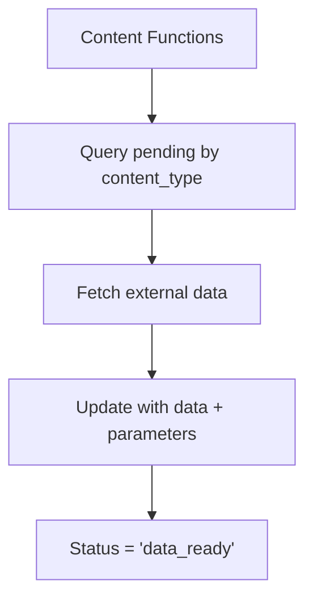
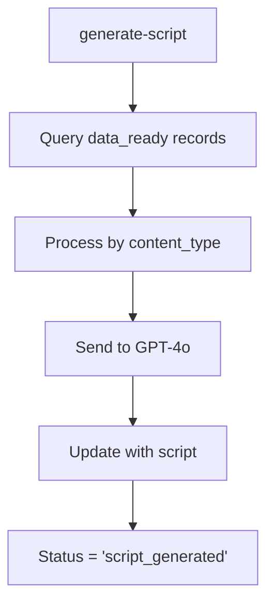
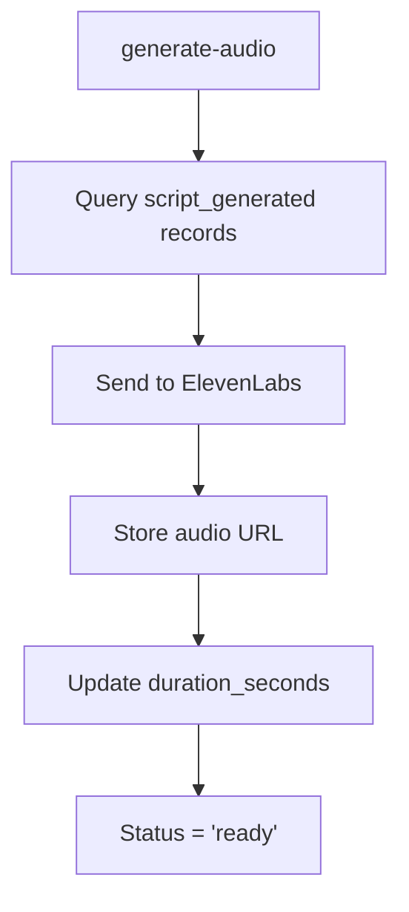
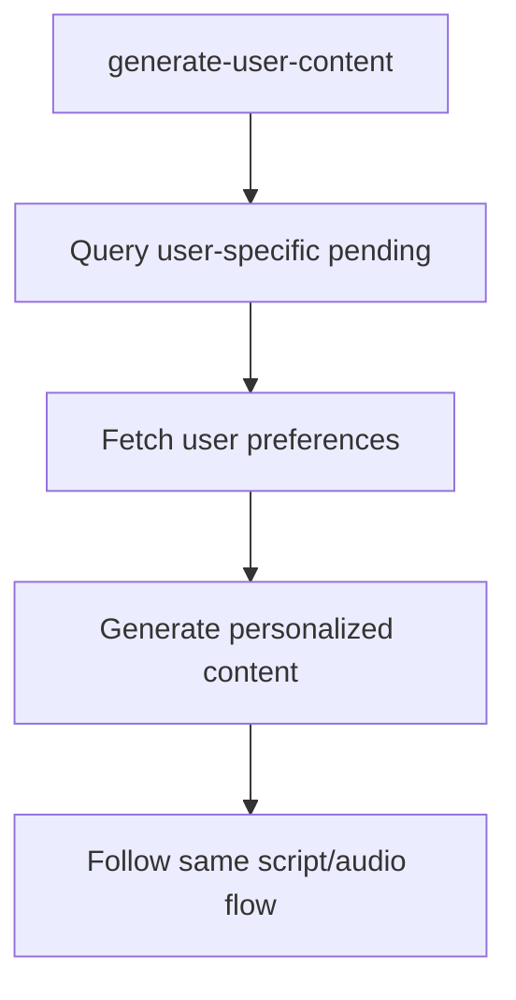

# DayStart Proposed Function Flow

## 🎯 Overview

This document outlines the proposed edge function architecture for DayStart's content generation system. The approach uses specialized content functions, unified script generation, and centralized audio processing.

## 📋 Function Architecture

### **Content-Specific Functions (6 total)**
Each function handles data fetching and content generation for a specific content type:

1. **`generate-wake-up-content`** - General wake-up messages and greetings
2. **`generate-weather-content`** - Weather data and forecasts
3. **`generate-markets-content`** - Financial market updates
4. **`generate-headlines-content`** - News headlines and summaries
5. **`generate-sports-content`** - Sports updates and highlights
6. **`generate-encouragement-content`** - Motivational content

### **Unified Processing Functions (3 total)**
Core functions that handle the generation pipeline:

9. **`generate-script`** - GPT-4o script generation
10. **`generate-audio`** - ElevenLabs audio synthesis
11. **`generate-user-content`** - User-specific content generation

## 🔄 Function Flow

### **Phase 1: Content Creation (Cron Job)**

**Cron Job Responsibilities:**
- Runs daily at 2 AM (configurable)
- Creates `pending` records for each content type
- Sets appropriate `expiration_date` based on content type
- Handles both shared and user-specific content

### **Phase 2: Content-Specific Data Fetching**

**Each Content Function:**
- Queries `content_blocks` where `status = 'pending'` AND `content_type = 'specific_type'`
- Fetches relevant external data via APIs
- Updates record with fetched data in `parameters` JSONB
- Sets status to `data_ready`

**Data Sources:**
- **Wake Up**: None (template-based)
- **Weather**: Weather Kit API (via user_weather_data cache)
- **News**: NewsAPI or similar
- **Sports**: ESPN API or similar
- **Markets**: Alpha Vantage or similar
- **Encouragement**: No external data needed

### **Phase 3: Script Generation**

**generate-script Function:**
- Queries `content_blocks` where `status = 'data_ready'`
- Processes each content type with appropriate GPT-4o prompts
- Updates record with generated `script`
- Sets `script_generated_at` timestamp
- Sets status to `script_generated`

### **Phase 4: Audio Generation**

**generate-audio Function:**
- Queries `content_blocks` where `status = 'script_generated'`
- Sends script to ElevenLabs with appropriate voice
- Stores generated audio URL in `audio_url`
- Updates `duration_seconds` and `audio_generated_at`
- Sets status to `ready`

### **Phase 5: User-Specific Content**

**generate-user-content Function:**
- Handles user-specific content types (`user_intro`, `user_outro`, `user_reminders`)
- Fetches user preferences from `user_preferences` table
- Generates personalized content based on user data
- Follows same script generation and audio generation flow

## 📊 Content Type Processing

### **Shared Content (user_id = NULL)**
| Content Type | Data Source | Generation Frequency | Expiration |
|--------------|-------------|---------------------|------------|
| `wake_up` | None (template-based) | Daily | 7 days |
| `weather` | Weather Kit API | Hourly | 24 hours |
| `headlines` | NewsAPI | 4 hours | 24 hours |
| `sports` | ESPN API | 4 hours | 24 hours |
| `markets` | Alpha Vantage | Hourly | 24 hours |
| `encouragement` | None (template-based) | Daily | 7 days |

### **User-Specific Content (user_id = specific)**
| Content Type | Data Source | Generation Frequency | Expiration |
|--------------|-------------|---------------------|------------|
| `user_intro` | User preferences | When saved | null |
| `user_outro` | User preferences | When saved | null |
| `user_reminders` | User data | When saved | When deleted by user |

## 🔄 Processing Order

### **Parallel Processing**
- **Content functions** can run in parallel
- **Multiple content types** can be processed simultaneously
- **No dependencies** between different content types

### **Sequential Processing**
- **Script generation** waits for data to be ready
- **Audio generation** waits for scripts to be generated
- **User content** follows same sequential flow

### **Queue Management**
- **Content functions** process all pending records of their type
- **Script generation** processes all data_ready records
- **Audio generation** processes all script_generated records

## 🚨 Error Handling

### **Retry Logic**
- **Failed API calls** retry with exponential backoff
- **GPT-4o failures** retry up to 3 times
- **ElevenLabs failures** retry up to 3 times
- **Increment `retry_count`** on each retry attempt

### **Status Tracking**
- **`pending`** → Initial state
- **`data_fetching`** → Fetching external data
- **`data_ready`** → Data fetched, ready for script generation
- **`script_generating`** → GPT-4o processing
- **`script_generated`** → Script ready, waiting for audio
- **`audio_generating`** → ElevenLabs processing
- **`ready`** → Complete and available
- **`failed`** → Generation failed after retries

### **Fallback Content**
- **Template content** for failed generations
- **Cached content** from previous successful generations
- **Graceful degradation** when services are unavailable

## 📈 Performance Considerations

### **Batch Processing**
- **Content functions** process multiple records per invocation
- **Script generation** batches GPT-4o requests
- **Audio generation** processes queue efficiently

### **Caching Strategy**
- **Shared content** cached for all users
- **User-specific content** cached per user
- **Template content** cached for fallbacks

### **Resource Management**
- **Function timeouts** set appropriately for each operation
- **Memory usage** optimized for large content processing
- **API rate limits** respected across all external services

## 🔧 Configuration

### **Environment Variables**
- **API keys** for external services
- **GPT-4o configuration** (model, temperature, etc.)
- **ElevenLabs configuration** (voices, quality settings)
- **Function timeouts** and retry settings

### **Content Templates**
- **Prompt templates** for each content type
- **Voice assignments** for different content types
- **Parameter validation** for content-specific data

## 📱 App Integration

### **Content Retrieval**
- **App queries** for `status = 'ready'` content
- **Filters** by `content_type`, `user_id`, `date`
- **Orders** by `content_priority` for assembly
- **Checks** `expiration_date` for validity

### **Audio Assembly**
- **App downloads** audio files from URLs
- **Assembles** final morning message locally
- **Handles** timing and transitions
- **Manages** offline playback

---

**Document Status**: Proposed Architecture  
**Last Updated**: January 2025  
**Next Step**: Implementation planning and edge function creation 