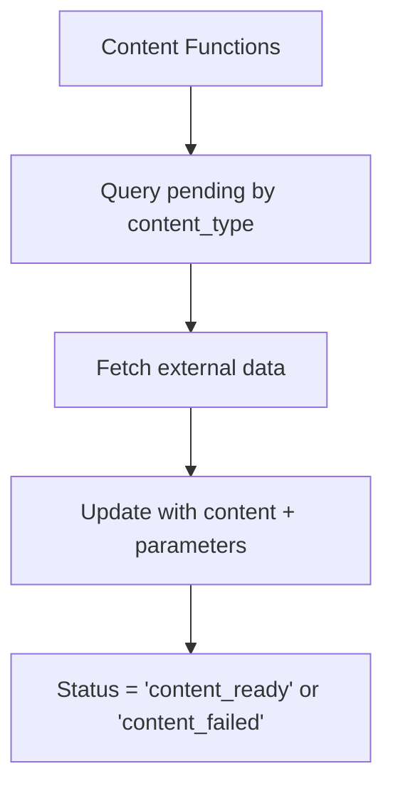
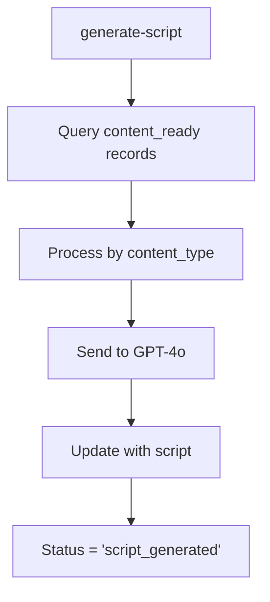

# DayStart Proposed Function Flow

## 🎯 Overview

This document outlines the proposed edge function architecture for DayStart's content generation system. The approach uses specialized content functions, unified script generation, and centralized audio processing.

## 📋 Function Architecture

### **Content-Specific Functions (6 total)**
Each function handles data fetching and content generation for a specific content type:

1. **`generate-wake-up-content`** - General wake-up messages and greetings
   - Creates 1 row for tomorrow's date (voice assigned during script generation)
   - Duration: 90 seconds
   - Content: Today's date, yesterday's message (to avoid repetition), holiday from Abstracts API
   
2. **`generate-weather-content`** - Weather data and forecasts
   - Creates 1 row (voice assigned during script generation)
   - Content: City, state, highs/lows, weather status, sunrise/sunset from user_weather_data table
   - Stores user_weather_data.id in parameters JSONB for future trigger reference
   
3. **`generate-headlines-content`** - News headlines and summaries
   - Creates 1 row (voice assigned during script generation)
   - Content: News from News API and GNews API
   
4. **`generate-sports-content`** - Sports updates and highlights
   - Creates 1 row (voice assigned during script generation)
   - Content: Sports data from SportsDB and ESPN APIs for today's and tomorrow's events
   
5. **`generate-markets-content`** - Financial market updates
   - Creates 1 row (voice assigned during script generation)
   - Content: Market data from Yahoo Finance API (via Rapid API) and business news from News API
   
6. **`generate-encouragement-content`** - Motivational content
   - Creates 5 rows (1 per type, voice assigned during script generation)
   - Types: Christian, Stoic, Muslim, Jewish, General
   - Content: Each type includes previous 5 encouragements from that specific category (stored in parameters) to avoid repetition

### **Unified Processing Functions (3 total)**
Core functions that handle the generation pipeline:

9. **`generate-script`** - GPT-4o script generation
10. **`generate-audio`** - ElevenLabs audio synthesis
11. **`generate-user-content`** - User-specific content generation

## 🔄 Function Flow

### **Phase 1: Content Creation (Cron Job)**

**Cron Job Responsibilities:**
- Runs daily at 2 AM (configurable)
- Creates `pending` records for each content type
- Sets appropriate `expiration_date` based on content type
- Handles both shared and user-specific content

### **Phase 2: Content-Specific Data Fetching**

**Each Content Function:**
- Queries `content_blocks` where `status = 'pending'` AND `content_type = 'specific_type'`
- Fetches relevant external data via APIs
- Updates record with text summary in `content` field and API data in `parameters` JSONB
- Sets status to `content_ready` (partial failures OK) or `content_failed` (complete failure)
- Logs all API calls and failures to `logs` table

**Data Sources:**
- **Wake Up**: Abstracts API (holidays)
- **Weather**: Weather Kit API (via user_weather_data cache)
- **News**: News API + GNews API
- **Sports**: SportsDB API (eventsday.php) + ESPN API
- **Markets**: Yahoo Finance API (via Rapid API) + News API (business)
- **Encouragement**: No external data needed

### **Phase 3: Script Generation**

**generate-script Function:**
- Queries `content_blocks` where `status = 'content_ready'`
- Processes each content type with appropriate GPT-4o prompts
- Updates record with generated `script`
- Sets `script_generated_at` timestamp
- Sets status to `script_generated`

### **Phase 4: Audio Generation**

```mermaid
graph TD
    A[generate-audio] --> B[Query script_generated records]
    B --> C[Optimistic locking: script_generated → audio_generating]
    C --> D[Send to ElevenLabs]
    D --> E[Store audio URL]
    E --> F[Update duration_seconds]
    F --> G[Status = 'ready']
```

**generate-audio Function:**
- Queries `content_blocks` where `status = 'script_generated'`
- Uses optimistic locking to prevent race conditions and duplicate processing
- Sends script to ElevenLabs with appropriate voice
- Stores generated audio URL in `audio_url`
- Updates `duration_seconds` and `audio_generated_at`
- Sets status to `ready`

### **Phase 5: User-Specific Content**

**generate-user-content Function:**
- Handles user-specific content types (`user_intro`, `user_outro`, `user_reminders`)
- Fetches user preferences from `user_preferences` table
- Generates personalized content based on user data
- Follows same script generation and audio generation flow

## 📊 Content Type Processing

### **Shared Content (user_id = NULL)**
| Content Type | Data Source | Generation Frequency | Expiration | Content Priority |
|--------------|-------------|---------------------|------------|------------------|
| `wake_up` | Abstracts API (holidays) | Daily | 72 hours | 1 |
| `weather` | Weather Kit API (via user_weather_data) | Hourly | 72 hours | 2 |
| `headlines` | News API + GNews API (general category) | 4 hours | 72 hours | 3 |
| `sports` | SportsDB API (eventsday.php) + ESPN API | 4 hours | 72 hours | 4 |
| `markets` | Yahoo Finance API (get-quotes) + News API (business) | Hourly | 72 hours | 5 |
| `encouragement` | Template-based (5 types) | Daily | 72 hours | 6 |

### **User-Specific Content (user_id = specific)**
| Content Type | Data Source | Generation Frequency | Expiration |
|--------------|-------------|---------------------|------------|
| `user_intro` | User preferences | When saved | null |
| `user_outro` | User preferences | When saved | null |
| `user_reminders` | User data | When saved | When deleted by user |

## 🔄 Processing Order

### **Parallel Processing**
- **Content functions** can run in parallel
- **Multiple content types** can be processed simultaneously
- **No dependencies** between different content types

### **Sequential Processing**
- **Script generation** waits for data to be ready
- **Audio generation** waits for scripts to be generated
- **User content** follows same sequential flow

### **Queue Management**
- **Content functions** process all pending records of their type
- **Script generation** processes all data_ready records
- **Audio generation** processes all script_generated records

## 🚨 Error Handling

### **Retry Logic**
- **Failed API calls** retry with exponential backoff
- **GPT-4o failures** retry up to 3 times
- **ElevenLabs failures** retry up to 3 times
- **Increment `retry_count`** on each retry attempt

### **Status Tracking**
- **`pending`** → Initial state
- **`content_generating`** → Content generation in progress
- **`content_ready`** → Content generated, ready for script generation (partial API failures OK)
- **`content_failed`** → All APIs and content generation failed
- **`script_generating`** → GPT-4o processing
- **`script_generated`** → Script ready, waiting for audio
- **`audio_generating`** → ElevenLabs processing
- **`ready`** → Complete and available
- **`failed`** → Generation failed after retries

### **Fallback Content**
- **Template content** for failed generations
- **Cached content** from previous successful generations
- **Graceful degradation** when services are unavailable
- **API failure handling**: Include "no data received" message in content
- **Logging**: Record API failures in `logs` table for monitoring

## 📈 Performance Considerations

### **Batch Processing**
- **Content functions** process multiple records per invocation
- **Script generation** batches GPT-4o requests
- **Audio generation** processes queue efficiently

### **Caching Strategy**
- **Shared content** cached for all users
- **User-specific content** cached per user
- **Template content** cached for fallbacks

### **Resource Management**
- **Function timeouts** set appropriately for each operation
- **Memory usage** optimized for large content processing
- **API rate limits** respected across all external services

## 🎤 Voice Configuration

### **ElevenLabs Voices**
- **`voice_1`** - Female, meditative wake-up voice
- **`voice_2`** - Male, drill sergeant voice
- **`voice_3`** - Male, narrative voice

### **Voice Assignment Strategy**
- **Content Generation**: Creates single rows without voice assignment
- **Script Generation**: Adds voice variants (voice_1, voice_2, voice_3) during script creation phase
- **Future**: Each content type will have 3 voice variants for user variety

## 🔧 Configuration

### **Environment Variables**
- **API keys** for external services
- **GPT-4o configuration** (model, temperature, etc.)
- **ElevenLabs configuration** (voices, quality settings)
- **Function timeouts** and retry settings

### **Content Templates**
- **Prompt templates** for each content type
- **Voice assignments** for different content types
- **Parameter validation** for content-specific data

## 📱 App Integration

### **Content Retrieval**
- **App queries** for `status = 'ready'` content
- **Filters** by `content_type`, `user_id`, `date`
- **Orders** by `content_priority` for assembly
- **Checks** `expiration_date` for validity

### **Audio Assembly**
- **App downloads** audio files from URLs
- **Assembles** final morning message locally
- **Handles** timing and transitions
- **Manages** offline playback

---

**Document Status**: Proposed Architecture  
**Last Updated**: January 2025  
**Next Step**: Implementation planning and edge function creation 