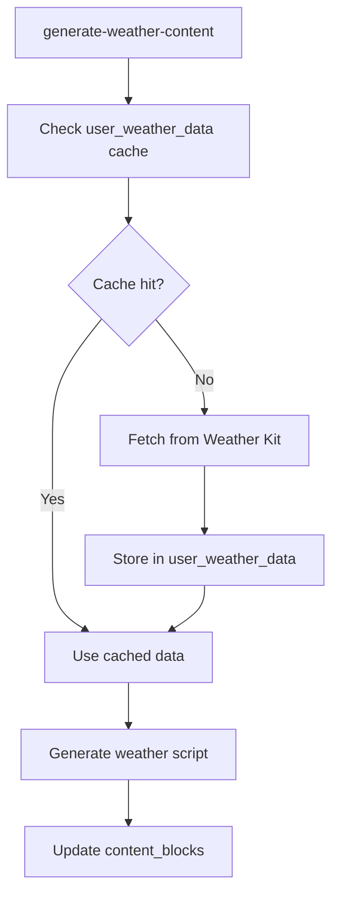

# DayStart Proposed User Weather Data Table

## 🎯 Overview

This document outlines the proposed `user_weather_data` table design for storing Weather Kit data as a shared resource. This table will serve as a cache for weather data that can be used by multiple users in the same location, reducing API calls and improving performance.

## 📋 Table Design

### **Table Name**: `user_weather_data`

### **Purpose**
Stores Weather Kit data as a shared resource, allowing multiple users in the same location to benefit from cached weather data without redundant API calls.

### **Columns**

| Column | Type | Description |
|--------|------|-------------|
| `id` | UUID | Primary key, auto-generated |
| `location_key` | VARCHAR(100) | Unique location identifier (zipcode or lat/lng) |
| `date` | DATE | Date this weather data is for |
| `weather_data` | JSONB | Complete Weather Kit response data |
| `last_updated` | TIMESTAMP WITH TIME ZONE | When this data was last fetched |
| `expires_at` | TIMESTAMP WITH TIME ZONE | When this data expires and should be refreshed |
| `fetch_count` | INTEGER | Number of times this data has been accessed |
| `created_at` | TIMESTAMP WITH TIME ZONE | When the record was first created |
| `updated_at` | TIMESTAMP WITH TIME ZONE | Last modification to the record |

### **Location Key Strategy**
The `location_key` field uses a standardized format to identify unique locations:

**For US locations:**
- Format: `zipcode` (e.g., "10001", "90210")

**For international locations:**
- Format: `lat_lng` (e.g., "40.7128_-74.0060" for NYC)

**Examples:**
```sql
-- US locations
location_key = '10001'  -- New York, NY
location_key = '90210'  -- Beverly Hills, CA

-- International locations  
location_key = '51.5074_-0.1278'  -- London, UK
location_key = '35.6762_139.6503'  -- Tokyo, Japan
```

### **Weather Data JSONB Structure**
The `weather_data` field stores the complete Weather Kit response:

```json
{
  "location": {
    "latitude": 40.7128,
    "longitude": -74.0060,
    "city": "New York",
    "state": "NY",
    "country": "US",
    "zipcode": "10001",
    "timezone": "America/New_York"
  },
  "current": {
    "temperature": 72.5,
    "feels_like": 74.2,
    "humidity": 65,
    "pressure": 1013.25,
    "visibility": 10.0,
    "wind_speed": 8.5,
    "wind_direction": 180,
    "condition": "partly_cloudy",
    "uv_index": 5,
    "timestamp": "2025-01-15T08:00:00Z"
  },
  "forecast": {
    "hourly": [
      {
        "time": "2025-01-15T09:00:00Z",
        "temperature": 75.0,
        "condition": "sunny",
        "precipitation_probability": 0.1
      }
      // ... more hourly data
    ],
    "daily": [
      {
        "date": "2025-01-15",
        "high": 78.0,
        "low": 65.0,
        "condition": "partly_cloudy",
        "precipitation_probability": 0.2,
        "sunrise": "07:15",
        "sunset": "16:45"
      }
      // ... more daily data
    ]
  },
  "alerts": [
    {
      "type": "severe_thunderstorm",
      "title": "Severe Thunderstorm Warning",
      "description": "Severe thunderstorms expected in the area",
      "expires": "2025-01-15T12:00:00Z"
    }
  ]
}
```

## 🔄 Workflow Integration

### **Weather Data Fetching Process**
1. **App requests weather content** for a specific location
2. **Check cache** for existing weather data in `user_weather_data`
3. **If cache hit**: Use existing data, increment `fetch_count`
4. **If cache miss**: Fetch from Weather Kit API
5. **Store new data** in `user_weather_data` table
6. **Generate weather content** using the weather data

### **Cache Management**
- **Expiration**: Weather data expires after 1 hour (configurable)
- **Cleanup**: Daily job removes expired records
- **Refresh**: Background job refreshes data before expiration
- **Sharing**: Multiple users in same location share cached data

### **Integration with Content Generation**


## 📊 Benefits

### **Performance**
- **Reduced API calls** - Multiple users share cached data
- **Faster response times** - No waiting for Weather Kit API
- **Lower costs** - Fewer API requests to Apple

### **Reliability**
- **Fallback data** - Cached data available during API outages
- **Consistent experience** - All users get same weather data for location
- **Reduced rate limiting** - Fewer API calls per location

### **Scalability**
- **Location-based sharing** - Efficient for popular locations
- **Automatic cleanup** - Prevents table bloat
- **Configurable expiration** - Balance freshness vs performance

## 🔐 RLS Policies

### **Access Control**
- **Read access** for all authenticated users (shared resource)
- **Write access** only for service role (background jobs)
- **No user-specific data** - location-based sharing

### **Policy Examples**
```sql
-- Users can read weather data (shared resource)
CREATE POLICY "Users can read weather data" ON user_weather_data
    FOR SELECT USING (true);

-- Service role can manage weather data
CREATE POLICY "Service role can manage weather data" ON user_weather_data
    FOR ALL USING (auth.role() = 'service_role');
```

## 📈 Indexes and Performance

### **Primary Indexes**
- Primary key on `id`
- Index on `(location_key, date)` for location lookups
- Index on `expires_at` for cleanup operations
- Index on `last_updated` for refresh operations

### **Query Optimization**
```sql
-- Find weather data for location and date
SELECT weather_data FROM user_weather_data 
WHERE location_key = '10001' AND date = '2025-01-15';

-- Find expired records for cleanup
SELECT id FROM user_weather_data 
WHERE expires_at < NOW();

-- Find records needing refresh
SELECT id FROM user_weather_data 
WHERE expires_at < NOW() + INTERVAL '30 minutes';
```

## 🚨 Considerations

### **Data Freshness**
- **Weather changes rapidly** - 1-hour cache expiration
- **Critical weather** - Alerts and severe weather bypass cache
- **User preferences** - Some users may want real-time data

### **Storage Management**
- **JSONB size** - Weather data can be large (several KB per record)
- **Cleanup strategy** - Regular removal of expired records
- **Archive strategy** - Historical weather data for analytics

### **API Limits**
- **Weather Kit quotas** - Monitor API usage
- **Rate limiting** - Implement backoff for failed requests
- **Fallback strategy** - Use cached data during API issues

## 🔧 Configuration

### **Environment Variables**
- `WEATHER_CACHE_EXPIRATION_HOURS` - Cache expiration time (default: 1)
- `WEATHER_REFRESH_BUFFER_MINUTES` - Refresh before expiration (default: 30)
- `WEATHER_MAX_CACHE_SIZE_MB` - Maximum cache size per location

### **Content Generation Integration**
- **Weather data lookup** in `generate-weather-content` function
- **Cache management** in background jobs
- **Error handling** for missing or expired data

## 📱 App Integration

### **Location Handling**
- **App provides location** (zipcode or coordinates)
- **Backend standardizes** location key format
- **Cache lookup** before API call
- **Fallback to API** if cache miss

### **User Experience**
- **Consistent weather** - All users in location get same data
- **Fast loading** - Cached data loads quickly
- **Reliable service** - Works during API outages

---

**Document Status**: Proposed Design  
**Last Updated**: January 2025  
**Next Step**: Migration creation and implementation 